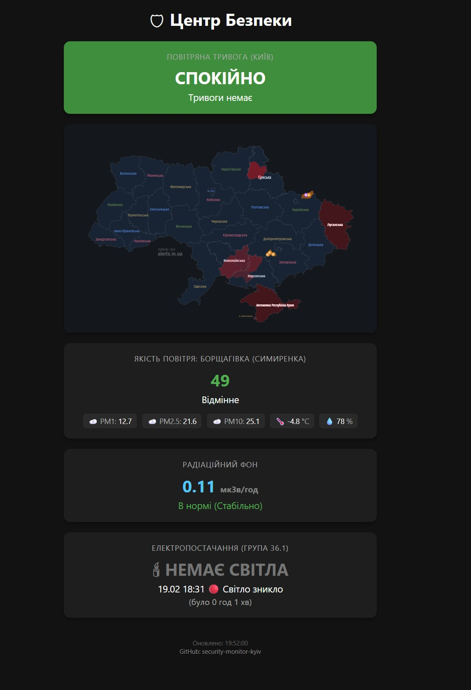

<p align="center">
  <a href="README_ENG.md">
    
  </a>
  <a href="README.md">
    
  </a>
</p>

<br>

# 🛡 Security Monitor (Kyiv)

[](https://www.python.org/)
[](https://flask.palletsprojects.com/)
[](LICENSE)
[]()

> **Modern security monitoring hub for your home (Kyiv Edition).**

**Security Monitor (Kyiv)** is a web dashboard that aggregates critical real-time security information. Designed to run on home servers (Raspberry Pi, VPS, Proxmox), it provides an instant overview of the situation outside your window.

---

## 🆕 Release Notes v1.2.1 (PWA & Air Quality)

This update focuses on improving environmental monitoring and usability.

### 🌟 What's New:
1.  **PWA Support (Mobile App):**
    *   The security hub can now be installed as a native app on your smartphone.
    *   Custom icon, manifest, and offline shell support added.

2.  **Expanded Air Quality Monitoring:**
    *   **SaveEcoBot Integration:** Added PM1 data fetching from station №17095 (Symyrenka St).
    *   **Open-Meteo API:** Fetching current temperature, humidity, PM2.5, and PM10.
    *   **Smart Interface:** The widget dynamically displays available parameters. If PM1 is unavailable, it hides automatically.

3.  **UI/UX Improvements:**
    *   Redesigned air quality widget (compact badges with parameters).
    *   Specified monitoring location: "Borshchahivka (Symyrenka St)".

---

## ✨ Key Features

*   🚨 **Air Raid Alerts:**
    *   Instant status for Kyiv and the region.
    *   Integrated live alert map (`alerts.in.ua`).
    *   Visual danger indication (red pulsing screen).

*   ☁️ **Air Quality & Weather:**
    *   Real-time data via OpenMeteo API.
    *   US AQI index, PM1, PM2.5, PM10.
    *   Current temperature and relative humidity.
    *   Color-coded status (Excellent, Moderate, Unhealthy).

*   💡 **Power Supply:**
    *   Integration with local [light-monitor-kyiv](https://github.com/weby-homelab/light-monitor-kyiv) service.
    *   Real-time "Power ON" / "Power OFF" status display.

*   ☢️ **Radiation Background:**
    *   Monitoring of gamma radiation levels (µSv/h).

*   🎨 **Modern Interface:**
    *   Dark Mode by default.
    *   Responsive design for mobile, tablets, and wall displays.
    *   Automatic data updates without page reloads (AJAX).

---

## 📸 Screenshots


*(Interface Preview)*

---

## 🛠 Tech Stack

*   **Backend:** Python 3 + Flask (Gunicorn for production).
*   **Frontend:** HTML5, CSS3 (Custom dark theme), Vanilla JS.
*   **API Integrations:**
    *   `ubilling.net.ua` (Alerts)
    *   `open-meteo.com` (Air Quality)
    *   Local API (Power Monitor)

---

## 🚀 Installation & Launch

### 1. Requirements
*   Linux server (Ubuntu/Debian)
*   Python 3.10+
*   Installed `light-monitor-kyiv` (optional, for power status)

### 2. Installation

```bash
# Clone repository
git clone https://github.com/weby-homelab/security-monitor-kyiv.git
cd security-monitor-kyiv

# Create virtual environment
python3 -m venv venv
source venv/bin/activate

# Install dependencies
pip install -r requirements.txt
```

### 3. Systemd Setup (High Load & Autostart)

For stable operation under load, we use Gunicorn with multiple workers. Create `/etc/systemd/system/security-monitor.service`:

```ini
[Unit]
Description=Security Monitor Kyiv (Flask App)
After=network.target

[Service]
User=root
WorkingDirectory=/path/to/security-monitor-kyiv
# Optimization: 4 workers + 2 threads for queue-free request processing
ExecStart=/path/to/security-monitor-kyiv/venv/bin/gunicorn --workers 4 --threads 2 -b 0.0.0.0:5000 app:app
Restart=always

[Install]
WantedBy=multi-user.target
```

Start the service:
```bash
systemctl daemon-reload
systemctl enable security-monitor
systemctl start security-monitor
```

### 4. Access & Security
⚠️ **Important:** Do not leave port 5000 open to the world (`0.0.0.0`) without protection.

Recommended access methods:
1.  **Cloudflare Tunnel:** Secure access without opening ports (Recommended).
2.  **Nginx Reverse Proxy:** Configure Nginx with SSL in front of Gunicorn.
3.  **VPN/Tailscale:** Access only from within the internal network.

Access example: `https://your-secure-domain.com` or `http://localhost:5000` (locally).

---

## 🤝 Contributing

We welcome any ideas! If you want to add support for new sensors or APIs:
1.  Fork the project.
2.  Create a branch (`git checkout -b feature/NewSensor`).
3.  Submit a Pull Request.

---

## 📜 License

© 2026 Weby Homelab — infrastructure that doesn’t give up.
Made with ❤️ in Kyiv under air raid sirens and blackouts...
